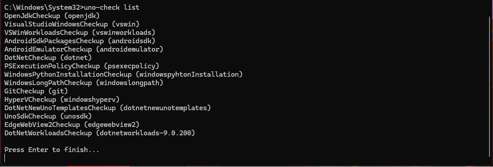

<!--markdownlint-disable MD025 MD001 -->
# Configuring Uno Check

## Overview of Command line arguments

To allow customizing and specifying the checks you want `uno-check` to do, it accepts some command line arguments.

<!-- TODO: Decide if this should instead be also a tab like this: # [**help**](#tab/arg-help) -->
[!INCLUDES [uno-check-help](../includes/uno-check-help.md)]

[!INCLUDES [Uno-Check-Windows-Elevation](../includes/uno-check-windows-elevation.md)]

> [!IMPORTANT]
> All of the following optional arguments require you to start your command with:
>
> `uno-check check`
>
> (the postfix `check` is optional, as uno-check defaults to this action.)

# [**target**](#tab/target)

Uno Platform supports a number of platforms, and you may only wish to develop for a subset of them. By default, the tool runs checks for all supported platforms. If you use the `--target` argument, it will only run checks for the nominated target or targets.

So, for example, the following will only check your environment for web and Linux development:

```bash
uno-check --target wasm --target linux
```

> [!NOTE]
> When specifying multiple target platforms, each element must be preceded by --target.
> It is not possible to list multiple values without this prefix.

Supported target platforms and their `--target` values:

| Target Platform  | Input Values                       |
|------------------|------------------------------------|
| WebAssembly      | `web`, `webassembly`, `wasm`       |
| iOS              | `ios`                              |
| Android          | `android`, `droid`                 |
| macOS            | `macos`                            |
| SkiaDesktop      | `skiadesktop`, `skia`, `linux`, `desktop`     |
| WinAppSDK        | `winappsdk`, `wasdk` , `winsdk`              |
| Windows          | `windows`, `win32desktop`, `win32` |
| All Platforms    | `all`                              |

# [**manifest**](#tab/manifest)

The manifest file is used by the tool to fetch the latest versions and requirements.
The default manifest is hosted at: `https://raw.githubusercontent.com/unoplatform/uno.check/main/manifests/uno.ui.manifest.json`

**Argument Value Syntax:**

```plaintext
`uno-check -m <FILE_OR_URL>`, `uno-check --manifest <FILE_OR_URL>` 
```

Use this option to specify an alternative manifest file path or URL, like this:

```bash
uno-check --manifest /some/other/file_or_url
```

Or short:

```bash
uno-check -m /some/other/file_or_url
```

# [**fix**](#tab/fix)

You can try using the `--fix` argument to automatically enable solutions to run without being prompted.

```bash
uno-check --fix
```

Or short:

```bash
uno-check -f
```

# [**non-interactive**](#tab/non-interactive)

If you're running on CI, you may want to run without any required input with the `--non-interactive` argument.  You can combine this with `--fix` to automatically fix without prompting.

```bash
uno-check --non-interactive
```

Or short:

```bash
uno-check -n
```

# [**preview / dev**](#tab/preview-and-dev)

This uses a more frequently updated manifest with newer versions of things more often. If you use the pre-release versions of Uno.UI NuGet packages, you should use this flag.

The manifest is hosted by default here: [uno.ui-preview.manifest.json](https://raw.githubusercontent.com/unoplatform/uno.check/main/manifests/uno.ui-preview.manifest.json)

```bash
uno-check --pre
```

**Synonym Arguments:** `--pre`, `--preview`, `-d`, `--dev`

# [**pre-major**](#tab/pre-major)

This generally uses the preview builds of the next major version of .NET available.

The manifest is hosted by default here: [uno.ui-preview-major.manifest.json](https://raw.githubusercontent.com/unoplatform/uno.check/main/manifests/uno.ui-preview-major.manifest.json)

```bash
uno-check --pre-major
```

# [**ci**](#tab/arg-ci)

Uses the dotnet-install powershell / bash scripts for installing the dotnet SDK version from the manifest instead of the global installer.

```bash
uno-check --ci
```

More Detailed Information about Uno.Check in CI: [Using Uno Check in CI Environment](xref:UnoCheck.Configuration.CI)

# [**skip**](#tab/skip)

Skips a checkup by name or ID. For more information for how to get all skip-able checks refer to the [list](#list) command.

> [!NOTE]
> If any other checkups depend on a skipped checkup, they will be skipped too.

**Argument Value Syntax:**

```plaintext
`uno-check -s <ID_OR_NAME>`, `--skip <ID_OR_NAME>`
```

Here is an Example:

```bash
uno-check --skip openjdk --skip androidsdk
```

Or short:

```bash
uno-check -s openjdk -s androidsdk
```

---

## list

Beside the general `check` command / action, you can get a list of available, skip-able checks by using:

```bash
uno-check list
```

Lists possible checkups in the format: `checkup_id (checkup_name)`.
These can be used to specify `--skip checkup_id` and `-s checkup_name` arguments.



## config

This allows you to quickly synchronize your `global.json` and/or `NuGet.config` in the current working directory to utilize the values specified in the manifest.

Arguments:

* `--dotnet` or `--dotnet-version`: Use the SDK version in the manifest in `global.json`.
* `--dotnet-pre true|false`: Change the `allowPrerelease` value in the `global.json`.
* `--dotnet-rollForward <OPTION>`: Change the `rollForward` value in `global.json` to one of the allowed values specified.
* `--nuget` or `--nuget-sources`: Adds the nuget sources specified in the manifest to the `NuGet.config` and creates the file if needed.

Example:

```bash
uno-check config --dev --nuget-sources --dotnet-version --dotnet-pre true
```

---

## See Also

* [Running Uno Check on Windows in Restricted Environment](xref:UnoCheck.Configuration.Windows.RestrictedEnvironments)
